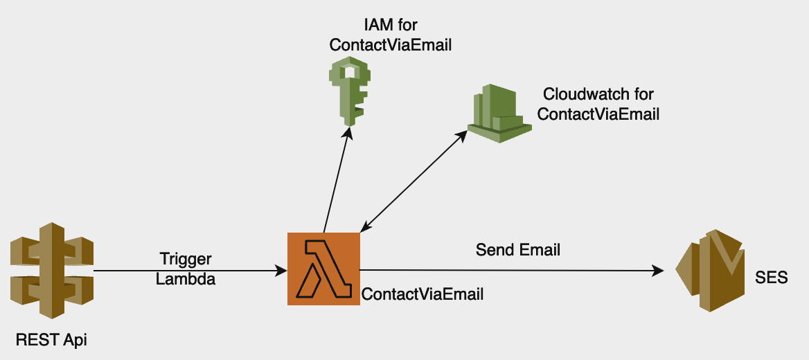

# Ujjwal Humagain

This repository contains my personal portfolio.

#### Portfolio Template by [HTML Codex](https://htmlcodex.com/) and modifications by @UjjwalHumagain

#### Look at my Portfolio at [https://www.ujjwalhumagain.click/](https://www.ujjwalhumagain.click/)

#### Feel Free to clone the repo and create your portfolio today!

# Daily Task

## Oct 20

1. Created GitHub Repository
2. Initialized repository with stater code
3. Bought a domain using Amazon Route 53 and validated certificate using Amazon Certificate Manager
4. Searched a portfolio template

## Oct 21

1. Added new designs in the template.
2. Added about section, skills, projects and other contents in the portfolio.
3. Uploaded everything in Amazon S3 bucket.
4. Configured AWS Cloudfront on top of S3 to serve the objects globally.
5. Created API Gateway and added POST method for contact form.

## Oct 22

1. Integrated AWS SES for email notification via contact form.
2. Configured AWS SQS to store messages asynchronously in Dynamo DB.
3. Updated design in the portfolio with new sections.

## Oct 23

1. Implemented CI/CD pipeline using AWS CodePipeline.
2. Blogged about the integration of AWS SES, SQS, Lambda and DynamoDB to make dynamic contact form in personal portfolio.

## Oct 24

1. Worked on making the demonstration video of the Project.

## Integration of AWS Services in the project

The diagram above shows the integration of AWS Services to store the contact form data into the DynamoDB and send email notifcation.

The diagram above shows the implementation of CI/CD pipeline in the project to sync the code changes done in version control directly to the live website via AWS CodePipeline.
